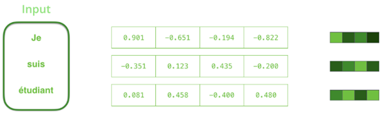
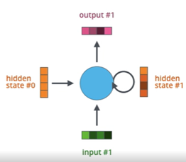
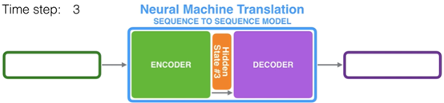
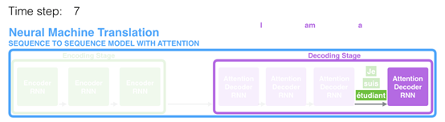
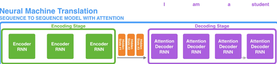
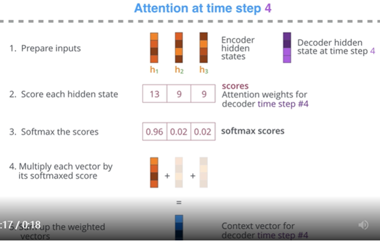
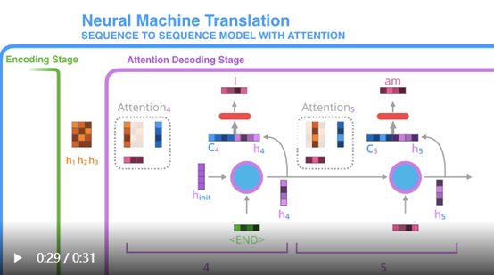
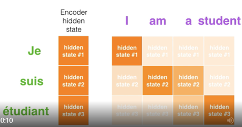
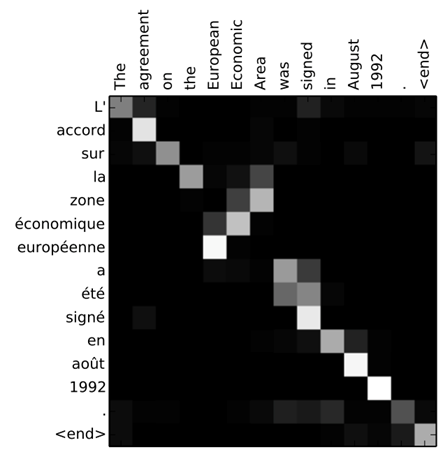

> document：https://jalammar.github.io/visualizing-neural-machine-translation-mechanics-of-seq2seq-models-with-attention/

## seq2seq model
输入是一个sequence，输出是一个（可能不等长的）sequence。

seq2seq model内部由由一个编码器(encoder)和一个解码器(decoder)组成。

encoder把input sequence里的items逐个编译，得到一个向量(context)，传给decoder，decoder开始逐个item地生产output sequence。

context是一个向量(an array of numbers)，encoder和decoder都是RNN。

在搭建模型时，你可以设定context的尺寸，它就是encoder RNN的hidden units的个数。以上的context的可视化展示了一个尺寸为4的向量，实际应用中尺寸一般是256,512,1024。

通过设计，一个RNN每个时间步取两个输入：一个input（encoder情况下是input sequence中的一个word）和一个hidden state。其中的word需要表示为一个向量，通过word embedding算法。这类算法把word转化到一个捕获word的很多语义的向量空间（e.g. king - man + woman = queen）

可用预训练的embeddings或在我们的数据集上训练出自己的embedding。Embedding向量一般尺寸200或300，以上可视化为尺寸4。

复习一下RNN：两个输入，处理得到两个输出

下一步取input #2和hidden state #1 产生这一步的输出。所以每一步更新的hidden state都是基于以前看到的所有inputs和当前这步的input。所以最后一步输出的hidden state就含有了所有inputs的信息。所以encoder传给decoder的context就是encoder RNN处理完input sequence的所有words之后最后一步输出的hidden state。

Decoder RNN的每一步的输入只有一个：hidden state，输出也只有一个：word

## Attention
Context向量显然成为了这种模型的一个瓶颈：它使模型很难处理长的sequence。Bahdanau et al., 2014 and Luong et al., 2015的论文提出了一个解决方法：引入且细化了一个叫attention的技术，它使得模型专注于input sequence里所被需要的有关部分。

比如在第7时间步，注意力机制使decoder专注于词étudiant，在它生成英语翻译student之前。

注意力机制和传统的seq2seq模型有两点不同：

第一，	encoder传给decoder更多的数据：所有的hidden states，而非仅最后一步的hidden state

第二，	一个attention decoder在产生它的输出之前还多做一步——为了专注于输入中与此decoding时间步相关的部分，decoder做以下事情：

a)	看它所接收到的encoder hidden states集合：每个encoder hidden state和input sequence里的某一个word最紧密相关

b)	给每个hidden state一个分数

c)	每个hidden state * 它自己的softmax分数，从而强调了有高分数的hidden states，溺死有低分数的hidden states

Decoder这边的每一时间步都做这个打分练习

## 总结 attention process

1、	attention decoder RNN收到<END> token(令牌)的embedding，于是初始化一个decoder hidden state

2、	这个RNN处理它的输入，产生一个输出和一个新的hidden state vector(h4)，输出被丢弃

3、	Attention步：用encoder hidden states和hidden state vector(h4)计算出此时间步的context vector(C4)

4、	合并(concatenate) h4和C4为一个vector

5、	将这个vector传给一个前传的神经网络FNN

6、	FNN的输出即此时间步的输出词

7、	下一个时间步重复以上。

另一个视角：

不只是输入的第一个词对应输出的第一个词，而是学习出语言上的词对：

"européenne économique zone"和"European Economic Area"词的顺序并不一致。
