https://jalammar.github.io/illustrated-transformer/
# Transformer
用attention给模型的训练加速，因为它可并行化。Google的Cloud TPU安利它。

Transfomer在论文Attention is All You Need中提出，它的tensorflow实现在Tensor2Tensor包里。

输入是一句话，输出是一句话，黑盒里是encoding component, decoding component, 和它们之间的connections。

# Encoder

encoding component是a stack of encoders（比如6个），decoding component是相同个数的a stack of decoders。

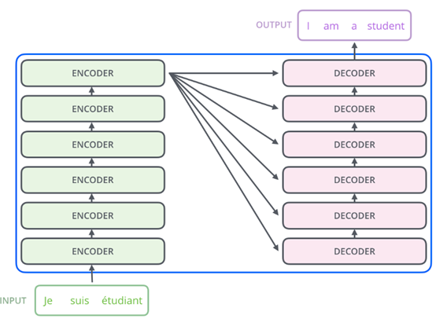

Encoders的结构都一样，但不共享相同权重。每个可分为两个子层：

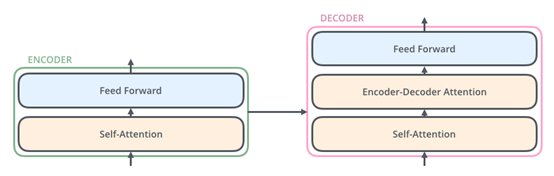

Encoder的输入首先进入一个self-attention层，这个层帮助encoder在encode某一个单词时看输入序列里的其它单词。

self-attention层的输出进入一个feed-forward NN。完全相同的FNN相互独立地应用到每个position。

Decoder也有这两层，但这两层之间还有一个attention层帮助decoder专注于输入序列里的有关部分（前一章已说）。

接下来看这些主要部分之间流动的向量/张量。
Embedding算法将输入的每个词转化成一个向量：

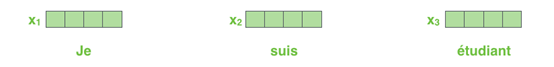

每个单词被embed成一个尺寸为512的向量。

这样的embedding只在最底层的encoder发生。每个encoder的输入都是由尺寸为512的向量们组成的列表，只是对于在最底层的encoder，这是word embeddings，对于其他层的encoders，这是下面那层encoder的输出。这个列表的尺寸一般是训练集里最长句子的长度。
在embed输入句子里的words之后，每个word embedding都流经encoder里的那两层。这是transformer的一个重要特性：每个position的word在encoder里流过它自己的路径。在self-attention层，这些路径之间有相关性。在feed-forward层，这些路径之间没有相关性，因此可以并行化执行。同一个encoder内，每个word流经的FFN都完全一样。

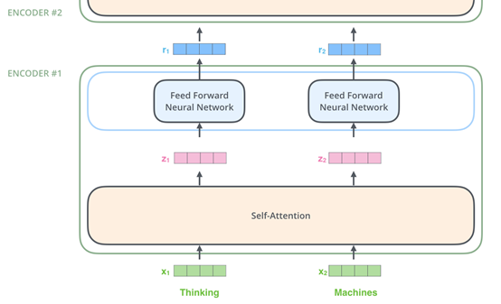

接下来看在encoder的每个子层里发生了什么。
## Self-attention

例子：输入的想翻译的话是”The animal didn't cross the street because it was too tired”。It指代的什么？street还是animal？当模型处理单词it时，self-attention让模型把it和animal联系起来。即，当模型处理每个单词（即输入序列里的每个位置）时，self-attention看输入序列里的其它位置，以找寻可以帮助更好encoding当前这个词的线索。就像RNN里，保持一个hidden state，以把以前处理过的词/向量的表示整合到当前正在处理的这一个中。

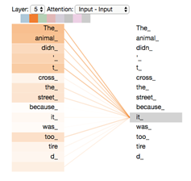

在encoder #5（最顶上的那个）中，attention机制注意在the animal，并将它的一部分表示烘培到it的encoding里了。

具体用vectors（实际上用的是matrices）怎么算self-attention？

### 第一步：算3向量

由encoder每个的input vector（即word embedding），计算出3个向量——a Query vector, a Key vector, and a Value vector。这些向量由embedding * 3个训练出的矩阵得到。这些新向量的尺寸比embedding向量小：embedding & encoder的输入输出向量的维数是512，但这3个新向量的维数是64。它们不是必须更小，而是结构选择它们。

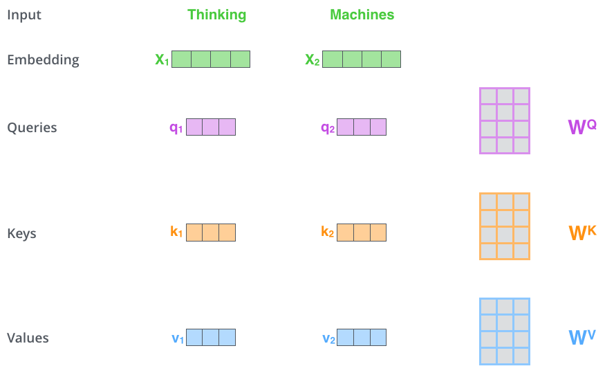

X1 * WQ = q1：该词的query vector

Query vector, a Key vector, and a Value vector是什么呢？

### 第二步：算score

比如要算第一个单词thinking的self-attention，则需要给输入句子里的每个词针对thinking打分。这个分数决定了当encode thinking这个词时，要对输入句子里的其它词focus多少。

每个单词的score = query vector *(点乘) key vector。

### 第三、四步：scores / 8，然后所有单词的结果进softmax

8 = key vector的维数64 的平方根，这会使梯度更stable.

softmax把所有单词的分数归一化，所以它们都正，且和=1。

### 第五步：每个单词的value vector * softmax score

保留想关注的words的value，忽视无关的words(比如通过*0.001)

### 第六步：所有weighted value vectors求和

得到了第一个单词的self-attention层的输出。

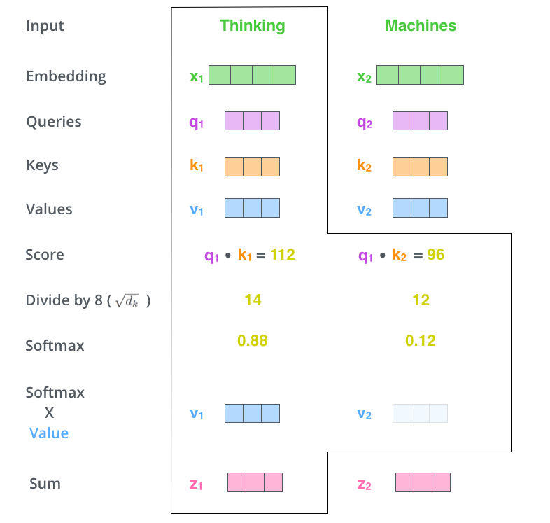

得到的向量可以输入给FFN。

实际上，这些计算是在**矩阵间**的，而不是在向量间的，为了更快。

**第一步**：算3向量，通过把embeddings打包成矩阵X，再分别*训练得到的矩阵WQ,WK,WV：

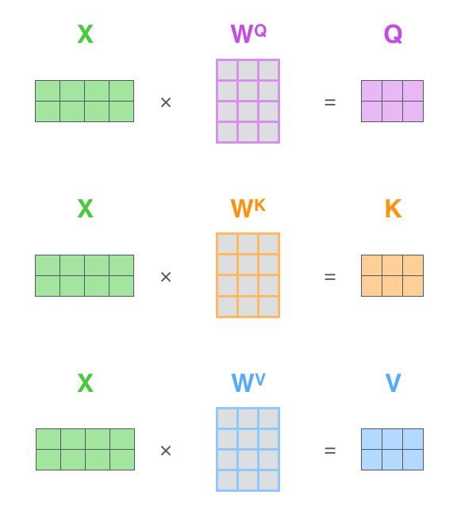

X的每行对应一个单词。还是能看到x向量和q/k/v向量的维度差别。

**第二~六步**：合成一个公式：

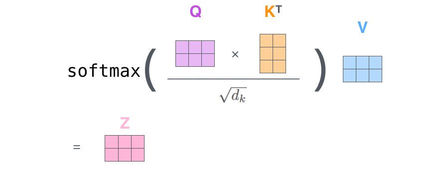

### 多头的注意力

multi-headed attention，提升attention层的性能：

1、提升了模型关注多个位置的能力

在以上，z1还是被自己那个单词主导了。但是对于it来说，为了知道它指代的哪个单词，需要真的关注到别的相关单词。

2、 给attention层多个representation subspaces

不仅有一套，而是多(8)套Query/Key/Value weight matrices。每套都被随机初始化。然后，每套都用于把输入的embeddings/下一层的encoder/decoder的输出投影到一个不同的representation subspace

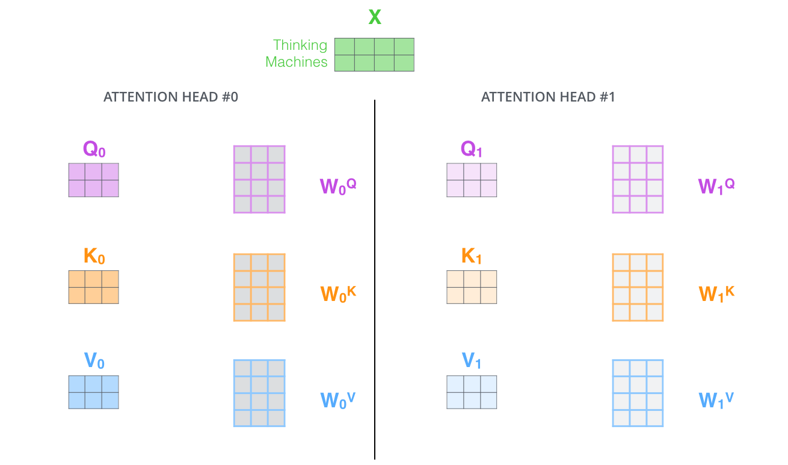

多个不同的WQ/K/V，得到多个不同的Q/K/V。

最终会得到多(8)个不同的Z矩阵：

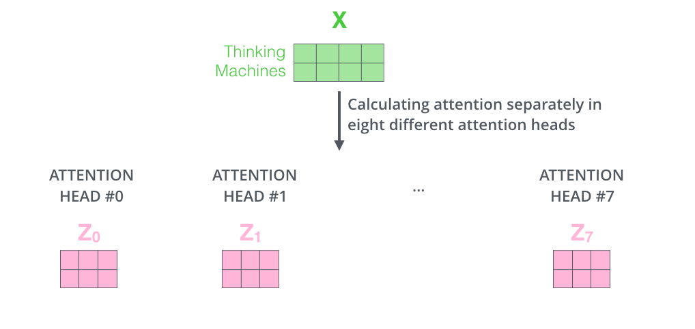

但FFN只期待一个输入矩阵（每个单词一个向量），所以需要把这8个矩阵合并成一个矩阵，通过concatenate，再* additional weights matrix WO:

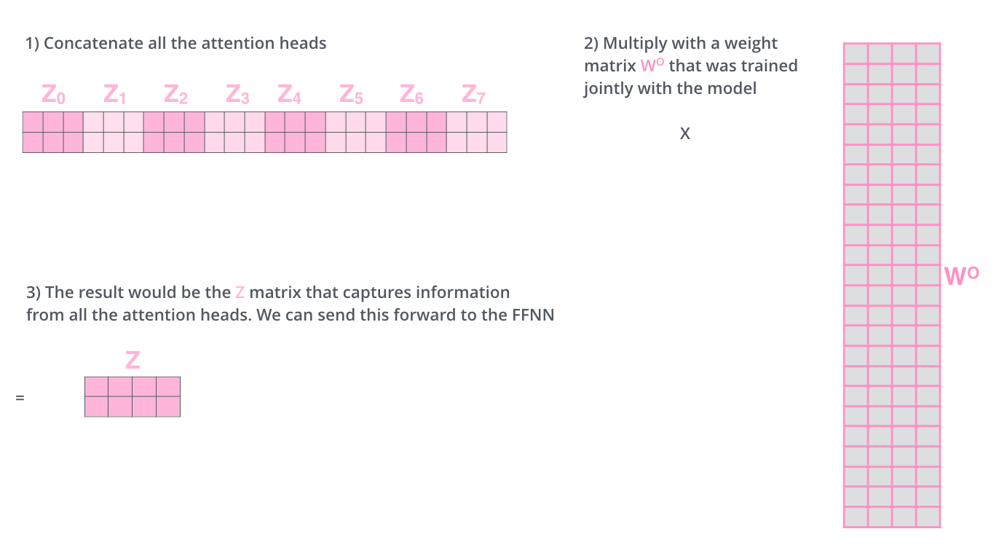

### 总结

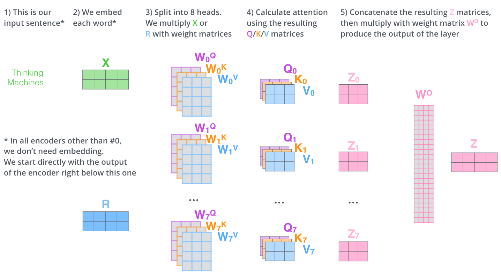

用例：

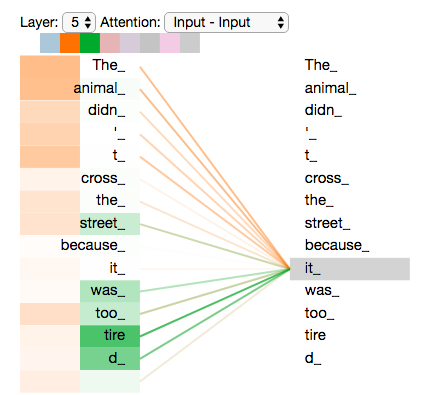

encode单词it时，一个attention head关注the animal，另一个关注tired，所以单词it的representation bakes in了animal和tired的representation。

如果看所有8个attention heads，反而更难解释：

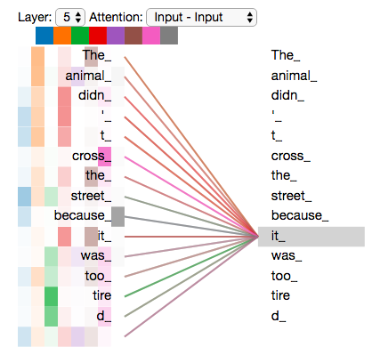

## 用positional encoding表示sequence的order

怎么表示输入序列里单词们的顺序？

为了解决它，给每个input embedding加一个向量。这些向量遵循模型学习出的特定样式，帮助确定每个单词的位置，或不同单词之间的距离。为了当它们被encode之后还能保留互相距离的信息。

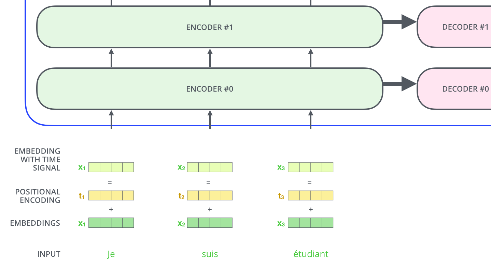

假设embedding的维数是4，则positional encoding实际上是：

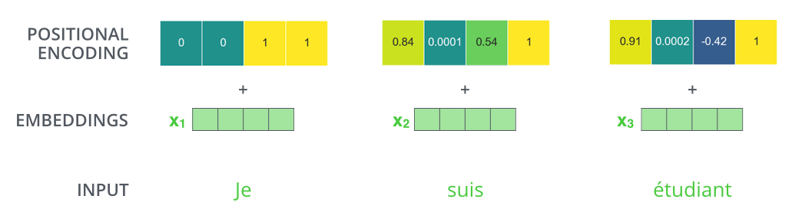

20个单词，每个单词的embedding维数512，则它们的positional encoding构成矩阵20*512：

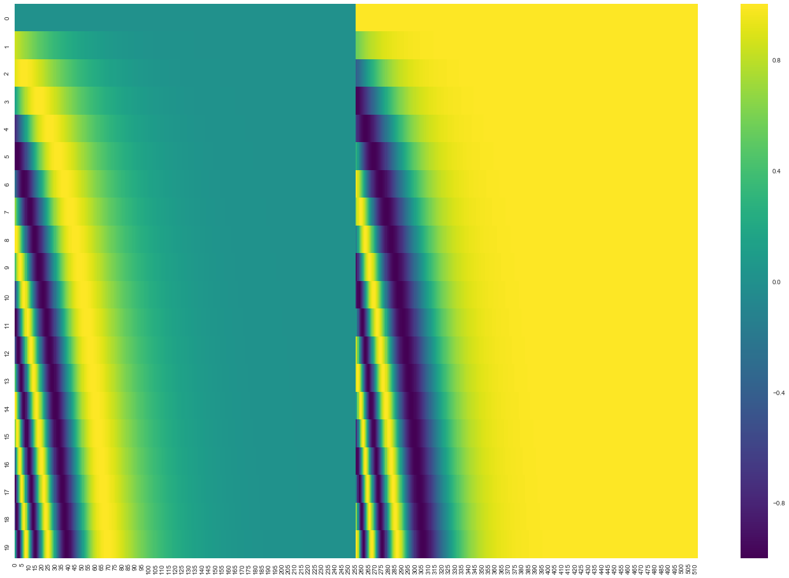

可在论文第3.5部分看到positional encoding的公式。也可在tensor2tensor的get_timing_signal_1d()函数里看。

## residuals

encoder里面还需要提一下的是，每个encoder的每个子层（self-attention, FFN）都有一个residual connection在它周围，接着是一步 layer-normalization。

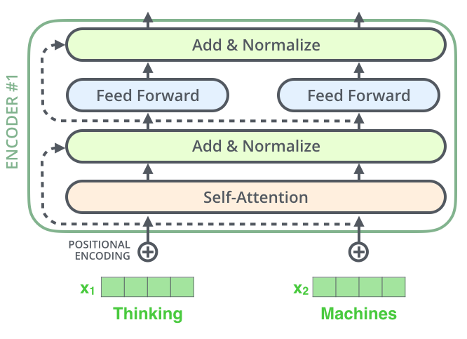

加上向量一起看：

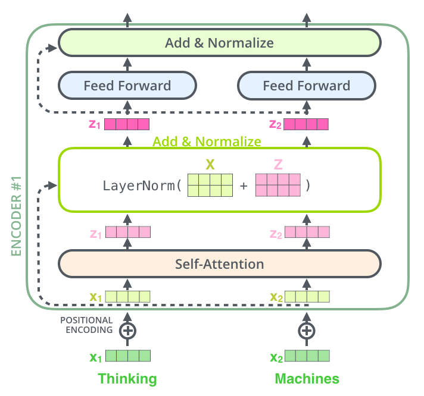

decoder的每个子层也是这样。合起来看a Transformer of 2 stacked encoders and decoders：

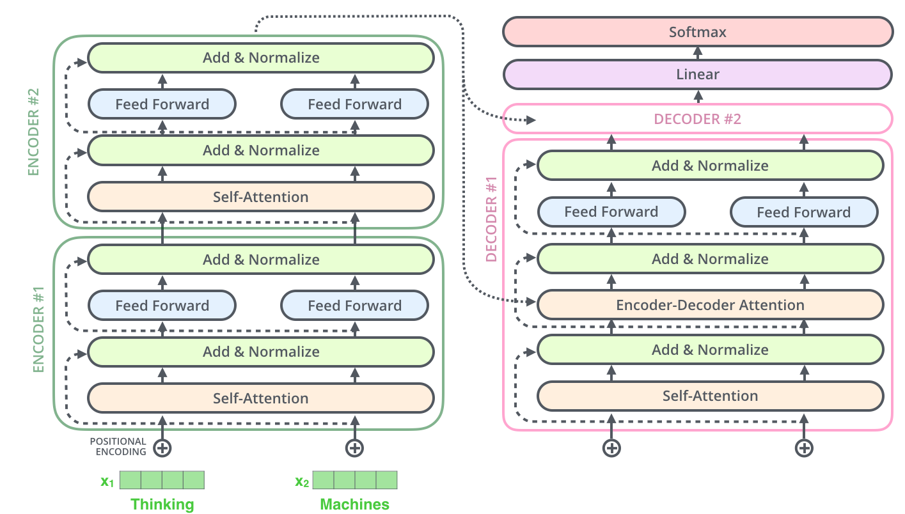

# Decoder
