> https://arxiv.org/pdf/1909.05746.pdf

Sliced Attention-based neural network
(Sams-Net) at the spectrogram domain

优点：比LSTM更容易并行计算；比CNN有更大的接受域

# 1、引入
基于：spectrogram / waveform。时域的SDR更好，但speech quality不好。

NN：feedforward fully connected network (FNN)，convolutional NN (CNN)，long short-term memory (LSTM)，后两者结合

缺点：

CNN——receptive field has limitations，越deep需要的receptive field越大。解决by multi-scale structure：下采样/上采样。可是尽管pooling可使receptive field变大，但失去频谱细节和空间信息。

LSTM——不能并行计算，因为依赖时间的特性。尽管能减轻长距离依赖问题，但不能解决。

Attention机制 **【19】** ：可让 feature interactions contribute
differently to the prediction。

Transformer **【20】**：用attention机制，且可自动捕获序列分布，从而学习输入序列的哪部分重要。可比LSTM更能解决长期依赖问题。且因为attention机制对计算没有时间依赖限制，所以transformer容易并行计算。且，同样层数，transformer的receptive field比CNN更大。BERT框架 **【21】**

# 2、音源分离问题

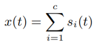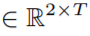

STFT: 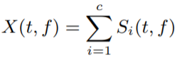: 2D array

ISTFT: mask Mi 点乘 |X|，再 * e的i角度次方 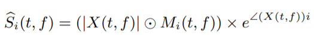

所以目标函数是：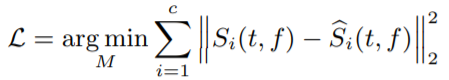

流程图：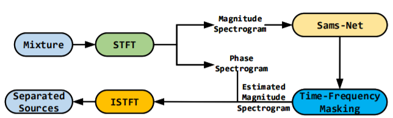

# 3、Sams-Net

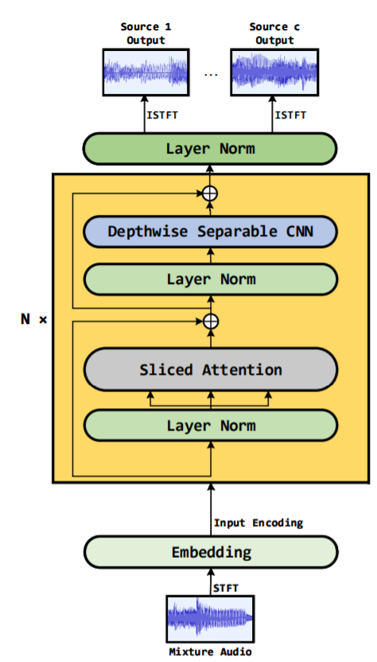

## 3.1、Scaled Dot-Product Attention

attention ：通过计算序列的元素们的相似性，学习权重的分布。这里使用点乘。

- 频谱幅值进一层kernel size 3*3的CNN：embedding 到 dk 维空间

- 1个1*1的CNN层用3次：分别得到query Q, key K, value V。

- Q *点乘 K , / √dk (标准化的角色，以让内积不过大，避免梯度消失问题), softmax: 得到在value V上的weights

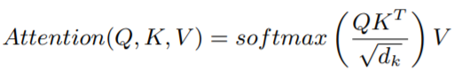

## 3.2、Multi-headed Attention

**【20】**

重复3.1、Scaled Dot-Product Attention h次，然后沿channel轴把结果concatenate到一起，然后CNN得到和原始attention尺寸一样的最终attention值们。

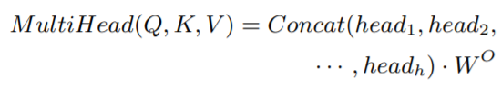

其中 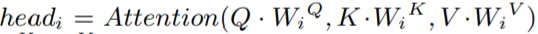，WQ,WK,WV是kernel size 1 * 1的CNN层，WO是3 * 3的CNN层，用于压缩特征图的数量。

## 3.3、Sliced Attention

先分别把频谱幅值Q,K,V的时间轴切片到i个组，且每片都保持完整频率信息。同时，attention的范围也缩小。每个组(Qi, Ki, Vi)配对算出attention value。最后，i个attention value被concatenate到一起，作为输出SA。

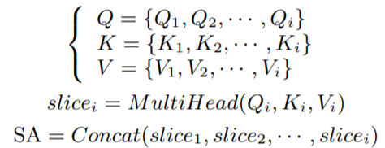

## 3.4、Depthwise Separable CNN

选这个** 【24】 ** 而非传统CNN。参数大幅减少，预测准确性并未明显影响。

- depth-wise CNN :
  feature map 独立地进  kernel size 3*3的CNN
  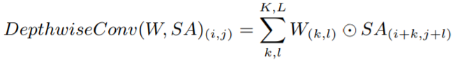
- point-wise CNN : 1个kernel size 1*1的CNN
- 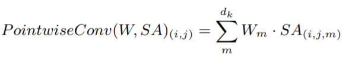

都是 element-wise *，W：CNN层的kernel，dk：feature maps的个数，K,L：频谱幅值的长度,宽度

## 3.5、Layer Norm

在以上的两个子层里用residual connections，然后做layer normalization **【26】**。
所以每个子层的输出都是：
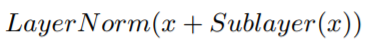

# 4、实验

MUSDB18，44.1kHz，随机选6秒

STFT的window: Hamming, frame length & hop size: 4096 & 1024

data augmentation **【28】**

评估：museval, BSSEvalv4

pytorch, 2 GPU

minimize MSE with Adam optimizer, learning rate 0.0001。如果validation loss 140 epoch之后没下降，则提前终止。

因为用很大的GPU memory，所以只能训练3 sliced attention modules with 2 heads and 64 channel dimensions

Slice Attention (slice=12)
