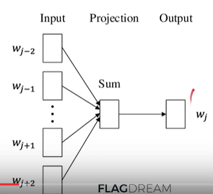

> youtube: NLP历史突破！快速解读Google BERT模型 + Word Embedding

# onehot encoding:

缺点：维数太高，乘法爆炸；每个单词是一维，互相正交独立，但事实上可能并不独立

# bag-of-words model:

统计一篇文章（/一句话）里的所有单词的出现次数，每篇文章转化成<word, count>映射成的一个向量，每个单词的值不再是0/1，而是可以>1。

优点：可比较两文章的相似度 in 向量空间 by: cosine; 欧几里得距离; 点乘; TF-IDF(每个单词对于这篇文章的重要性)

以上两种方法的每个单词都是互相独立的，但其实不对：同类名词，同一个动词的不同时态，同意义的形容词，上下文背景（play + games, piano, ps4...）

# word embedding

手动(不现实) / word embedding的映射 : 分类成distributed representation

 f: word embedding

无监督地把每个单词都映射成一个长度为128的向量。怎么做？

## autoencoder network (GAN): 输入x经hidden layer生成长度128的输出z，因无标签，所以再反向hidden layer生成输出x'，x和x'比较

## neural network language model

上文的feature就是输入，输出下文单词，和真实下文比较。

## word2vec

paper: 2013, google, tomas mikolov, jeffrey dean

单给一个单词没有意义，在上下文中才有意义

### CBOW: 上下文embedding后softmax求中间单词

### Skip-gram: 中间单词embedding后求上下文

CBOW更常用

训练很贵，解决办法：

#### Huffman编码 + 阶级化的softmax

更常用的单词放到树的更前面，主要解决softmax计算量大的问题

#### negative sampling

CBOW每次只反向更新一个单词wj，很亏，所以夹带私货，再更新一个单词

经过word2vec得到的向量空间的特点：

相似单词距离近：

加减法：France - Paris + Beijing = China

## Glove

Global Vectors for Word representation

和Word2Vec相近，但要看全文

# ELMo

解决多义词的问题

以前一个单词的embedding都是静态的，现在一个单词会产生3个embedding，根据实际问题改变在3个embedding前面的3个权重，再把它们组合到一起，实现动态。

word embedding + 两层双向lstm：
3个embedding：橙色，蓝色，绿色。结果w1v1+w2v2+w3v3

# BERT

bidirectional encoder representation from transformers

paper: google 2018

结构和ELMo非常相近，只不过把rnn换成了transformer

## masked language model

像完形填空，在训练时随机地把某些单词遮蔽掉。这是一种变相的dropout

# BERT

bert-as-service 小规模

google dataset search
